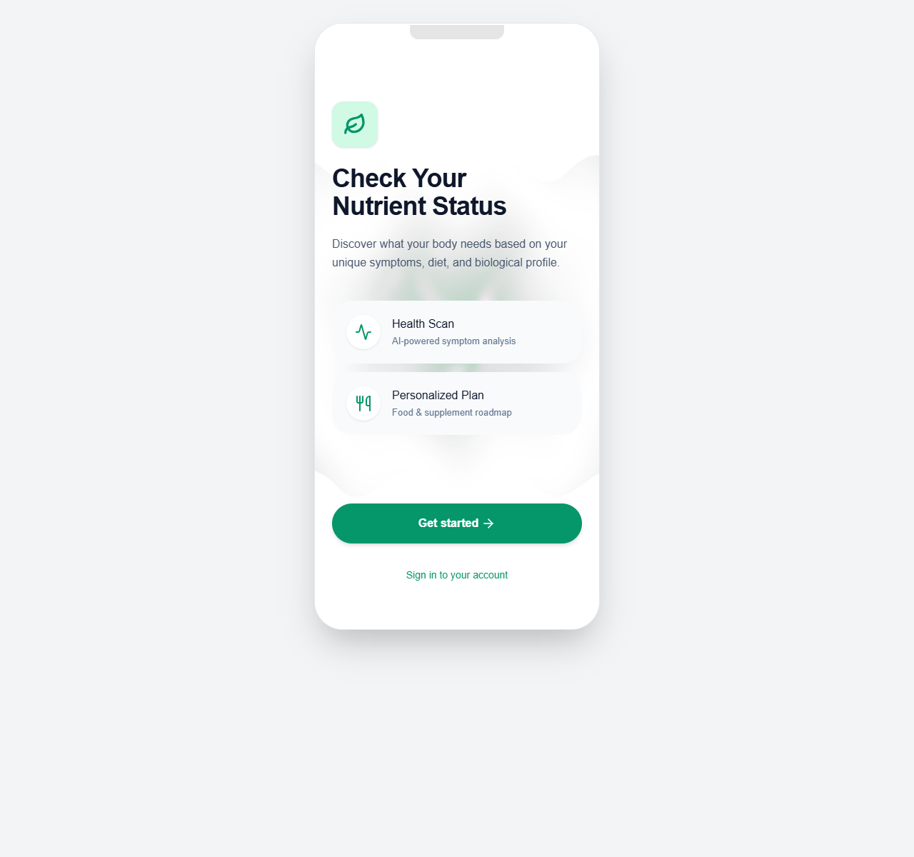
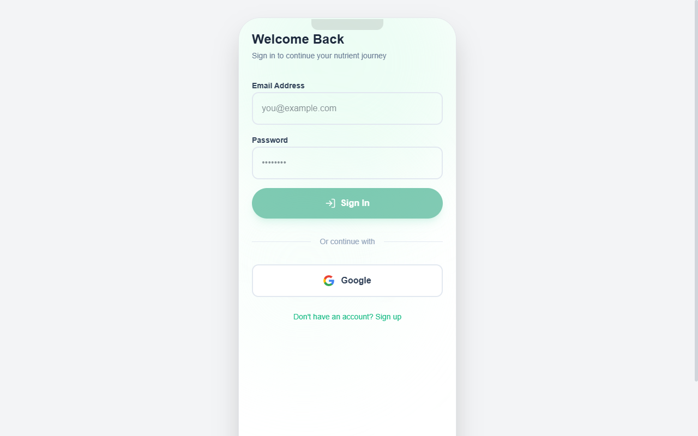
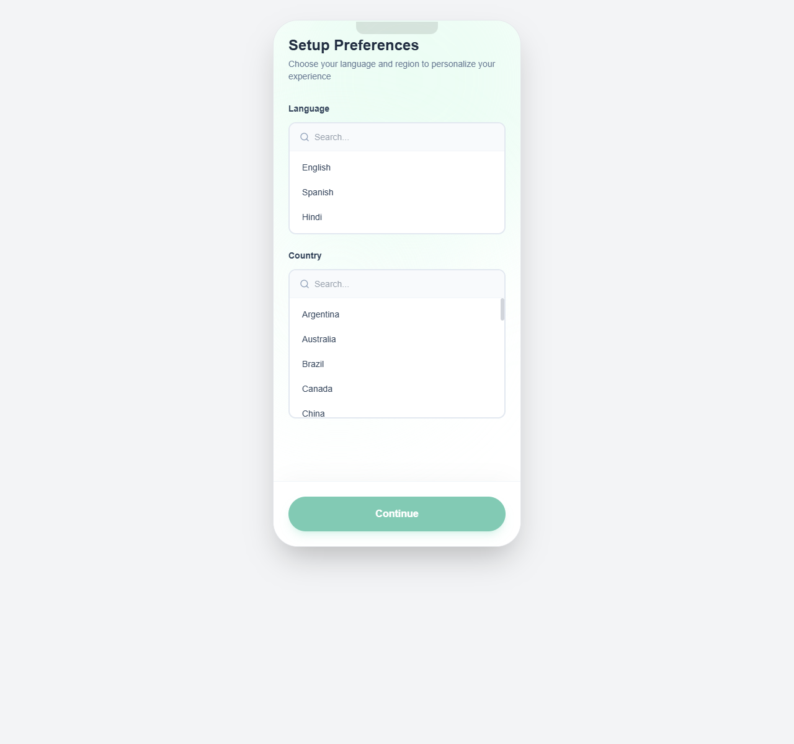
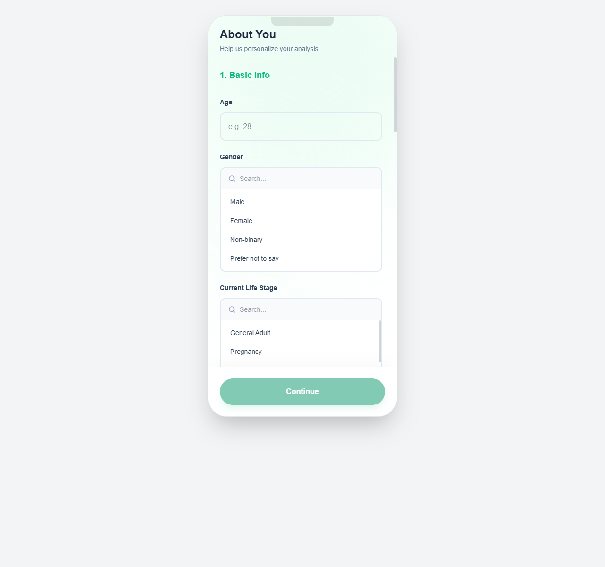
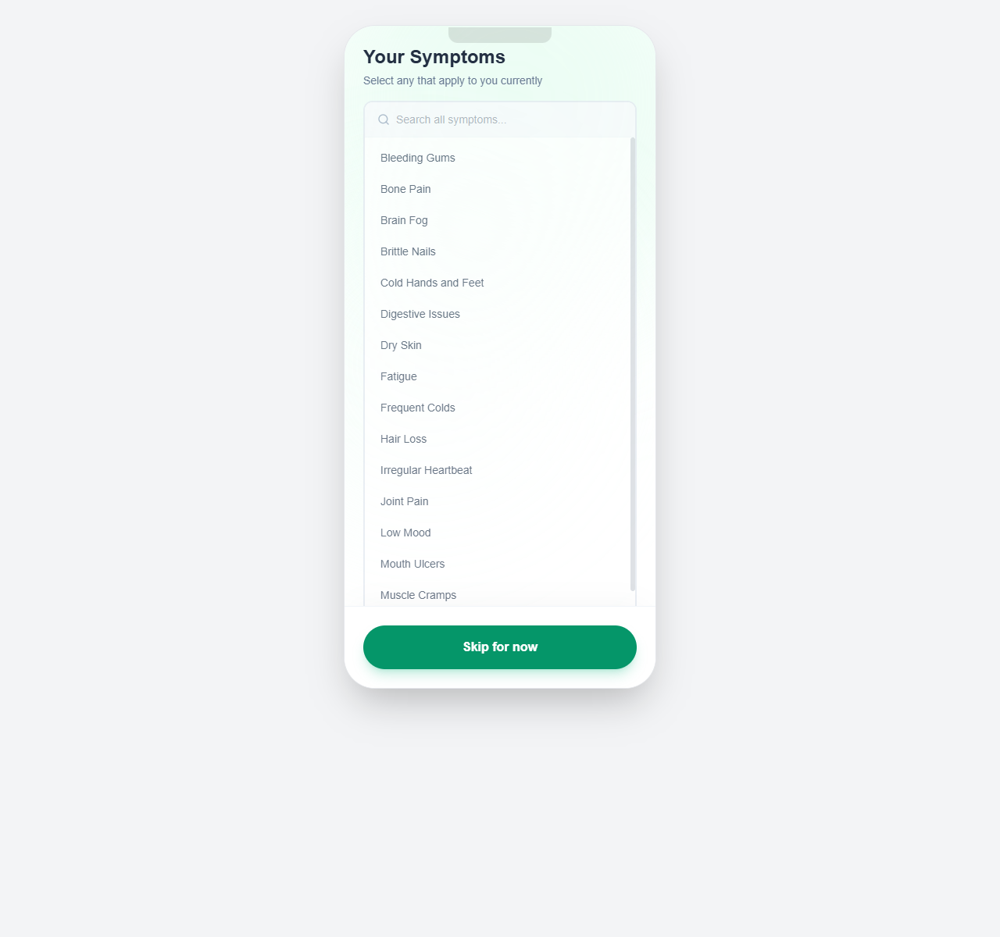
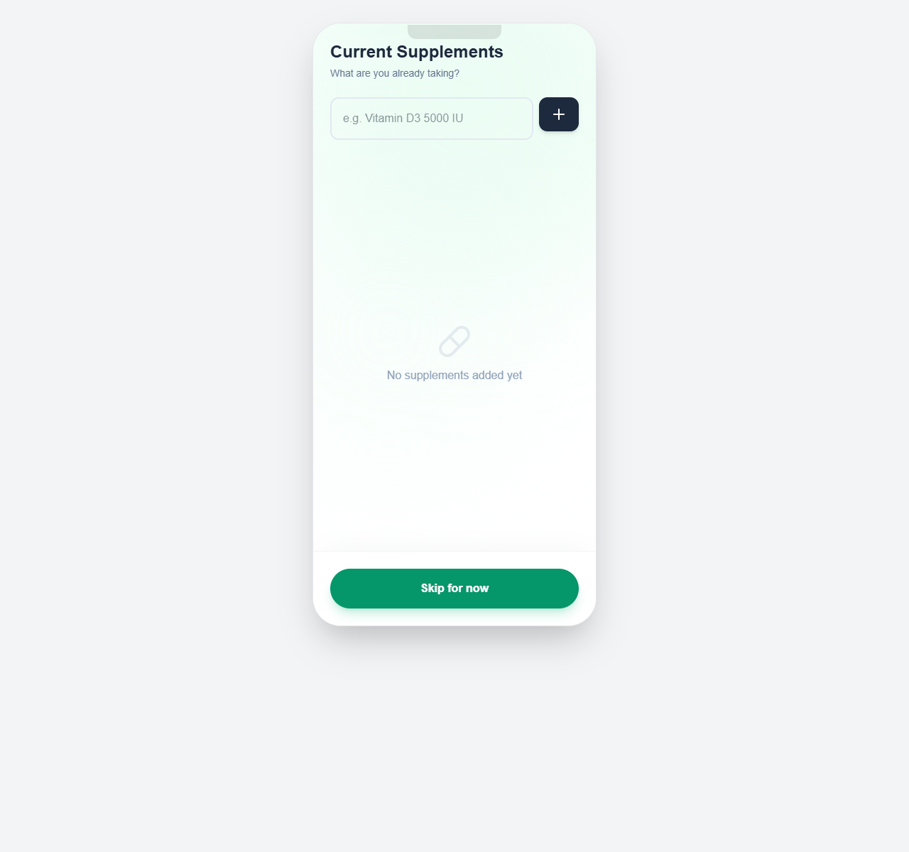
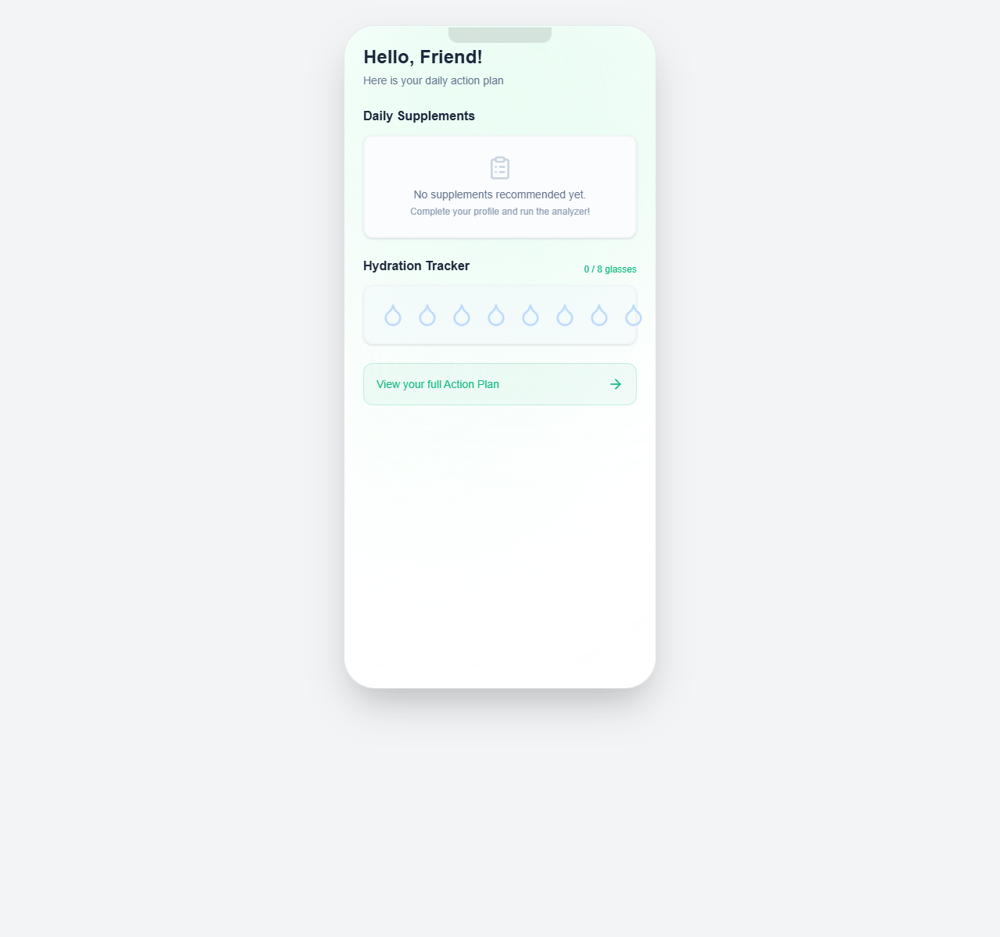

# 🌌 AI Micronutrient App

[](https://react.dev/)
[](https://www.typescriptlang.org/)
[](https://vite.dev/)
[](https://tailwindcss.com/)
[](https://threejs.org/)
[](https://firebase.google.com/)

A premium, highly interactive mobile-first React application designed to analyze personal biological profiles and generate customized micronutrient plans. Combining **3D WebGL procedural shaders**, **dynamic localization (i18n)**, and an **intelligent deficiency engine**, it showcases clean code structure, modern styling tokens, and interactive micro-animations.

---

## 📱 Interactive User Experience

<p align="center">
  <table width="100%">
    <tr>
      <td width="33%" align="center" valign="top">
        <b>1. Onboarding Screen</b><br/>
        <sub>Procedural WebGL Shaders</sub><br/><br/>
        
      </td>
      <td width="33%" align="center" valign="top">
        <b>2. Secure Auth</b><br/>
        <sub>Firebase Account Gate</sub><br/><br/>
        
      </td>
      <td width="33%" align="center" valign="top">
        <b>3. Localization Setup</b><br/>
        <sub>Preferences gate</sub><br/><br/>
        
      </td>
    </tr>
    <tr>
      <td width="33%" align="center" valign="top">
        <b>4. Biological Profiling</b><br/>
        <sub>Demographic Intake Form</sub><br/><br/>
        
      </td>
      <td width="33%" align="center" valign="top">
        <b>5. Symptom Checker</b><br/>
        <sub>Deficiency Assessment</sub><br/><br/>
        
      </td>
      <td width="33%" align="center" valign="top">
        <b>6. Supplement Tracker</b><br/>
        <sub>Logging Active Intake</sub><br/><br/>
        
      </td>
    </tr>
    <tr>
      <td colspan="3" align="center" valign="top">
        <table width="40%">
          <tr>
            <td align="center" valign="top">
              <b>7. Personal Dashboard</b><br/>
              <sub>Supplement Intake & Hydration Tracker</sub><br/><br/>
              
            </td>
          </tr>
        </table>
      </td>
    </tr>
  </table>
</p>

---

## 🚀 Key Engineering & Architecture Highlights

### 1. 🪐 Math & Shader Graphics (WebGL + React Three Fiber)
- **Dynamic Shading**: Integrates Three.js fragment and vertex shaders inside a responsive canvas overlay.
- **Mathematical Organic Mesh**: Renders procedural wave logic directly on the GPU using time-dependent coordinates to create animated ambient mesh movements.

### 2. 🌍 Advanced Localization Sync (i18next)
- **Automatic Language Sync**: Automatically routes authenticated users through a preferences gate (`Preferences.tsx`) to set preferred languages (English, Spanish, Hindi) and geographical regions.
- **State-to-Engine Synchronization**: An active hook synchronizes user state shifts with the underlying `i18next` configuration, instantly translating all layouts, forms, error messages, and dynamic selection fields.

### 3. ⚙️ Smart Deficiency Analyzer Engine
- **Region-Aware Recommendations**: Customizes food suggestions dynamically based on geographical regions. (e.g. prioritizes local ingredients for users in India/Mexico).
- **Daylight Solar Calibration**: Integrates mathematical daylight/solar exposure calculation matching geographical latitude constraints to estimate personal Vitamin D synthesis capability.

### 4. 🎛️ Scalable UI Taxonomy Systems
- Replaces static options with a reusable `SearchableSelect` filtering engine supporting complex data fields (Genders, 10 Life Stages, 15 Health Goals, 12 Diet Types, and 15 major Medical Conditions/Allergies).

---

## 🛠️ Technology Stack

- **Frontend**: React 19, TypeScript, Vite
- **Animations**: Framer Motion
- **Styles**: Tailwind CSS v4.0 (utilizing `@theme` configuration directives)
- **3D Engine**: Three.js, `@react-three/fiber`
- **State & Routing**: React Router v7, Zustand-style Context Store
- **Database & Auth**: Firebase Auth, Firestore SDK

---

## 💻 Local Setup & Installation

### Prerequisites
- Node.js (v18 or higher)
- NPM

### Steps
1. Clone the repository and install project dependencies:
   ```bash
   npm install --legacy-peer-deps
   ```
2. Initialize environment keys by creating a local file `.env` (refer to `.env.example` template):
   ```bash
   VITE_FIREBASE_API_KEY=your_key
   VITE_FIREBASE_AUTH_DOMAIN=your_auth_domain
   ...
   ```
3. Run the development server locally:
   ```bash
   npm run dev
   ```
   Open **[http://localhost:5173](http://localhost:5173)** in your browser.

4. Build and minify for production:
   ```bash
   npm run build
   ```
